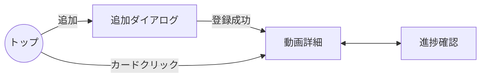

# モック仕様（UI/データ）

本ドキュメントは、コピー練習進捗アプリのモック（画面遷移・UI 挙動・データ構造）の合意用仕様です。最小構成での体験を定義し、実装前の確認に用います。

## 概要
1. トップ: 登録済み動画のサムネイル一覧＋「追加カード」を表示。
2. 追加: 「追加カード」クリックで YouTube URL 入力ダイアログを表示。
3. 登録: URL を保存し、動画詳細へ遷移（動画情報を表示）。
4. 練習記録: 動画の長さを 5 秒ブロックに分割し、横=時間、縦=3 段の習熟度をタップ操作で記録。

---

## 用語
- 動画カード: トップのサムネイル付きカード。
- 習熟レベル: 0〜3 の段階（0=未着手, 1=少し, 2=だいたい, 3=完全）。
- ブロック: 5 秒ごとの最小単位。動画長を 5 秒で割って配列化。

## 画面一覧
1) トップ画面（一覧）
2) 動画追加ダイアログ（モーダル）
3) 動画詳細（練習タイムライン）
4) 進捗確認（全体グリッド）

## 画面遷移
トップ →（追加カード）→ 追加ダイアログ → 登録 → 動画詳細
トップ →（動画カード）→ 動画詳細
動画詳細 ↔ 進捗確認



---

## トップ画面（一覧）
- レイアウト: カードグリッド（3〜4 列想定）。先頭 or 末尾に「＋ 追加」カード。
- 動画カード表示項目:
  - サムネイル、タイトル、動画長、進捗率（%）、最終更新日時
- 操作:
  - クリック: 動画詳細へ遷移
  - 右上メニュー: 編集（タイトル/メモ）、削除（確認ダイアログあり）
- 空状態:
  - 「まず YouTube URL を追加してください」＋ガイド文

## 動画追加ダイアログ
- 入力項目:
  - YouTube URL（必須）
  - タイトル（任意。取得できれば自動入力）
  - 楽器種別（任意。例: Guitar/Bass/Drums）
  - メモ（任意）
- バリデーション:
  - URL 形式チェック、YouTube 動画 ID 抽出可否
  - 動画長取得に失敗した場合は暫定値（例: 180 秒）で登録し、後で更新可能
- アクション:
  - 保存: `localStorage` へ動画情報と空のトラックを作成
  - キャンセル: 破棄して閉じる

## 動画詳細（練習タイムライン）
- ヘッダー:
  - 戻る、タイトル、動画サムネ（または埋め込みプレイヤーへの切替は後日）
  - メタ: 総ブロック数、完了率、最終更新
- タイムライン（中心機能）:
  - 横方向: 時間（5 秒単位ブロックが左→右）
  - 縦方向: 習熟レベル 3 段を視覚化（下から上へ 1→2→3 で積み上がるイメージ）
  - セル状態: レベル 0/1/2/3 に応じた配色（例: 0=枠線のみ, 1=淡色, 2=中間, 3=濃色）
  - 操作:
    - タップ/クリック: 対象ブロックのレベルを 0→1→2→3→0 とトグル
    - 長押し/長クリック: レベル 0 にクリア
    - ドラッグ（PC）/スワイプ（モバイル）: 範囲適用（開始レベルを維持）
    - ショートカット（PC）: `1/2/3` で直近選択ブロックのレベル設定、`0` でクリア
- 集計表示:
  - 完了率（カバレッジ）: `count(level > 0) / blocks * 100%`（低レベル到達でカウント）
  - 習熟度（縦軸平均）: `sum(levels) / (3 * blocks) * 100%`
  - 推定練習時間: `blockSizeSec * count(level > 0)` を分に換算表示
  - ハイライト: 直近で更新したブロック周辺を軽く点滅

---

## データモデル（ローカル専用・初期実装）
```ts
type Video = {
  id: string;                // uuid
  provider: 'youtube';
  videoId: string;           // YouTube の ID
  url: string;               // 入力URL（正規化済み）
  title: string;
  durationSec: number;       // 総秒数
  thumbnailUrl: string;      // https://img.youtube.com/vi/{id}/hqdefault.jpg など
  instrument?: string;       // 任意
  note?: string;             // 任意
  createdAt: string;         // ISO8601
  updatedAt: string;         // ISO8601
}

type Track = {
  videoId: string;           // Video.id ではなく videoId で紐付けるか、必要なら両方持つ
  blockSizeSec: 5;           // 固定 5 秒
  levels: number[];          // 各ブロックの習熟レベル 0..3
}
```

- ストレージキー:
  - `tracknote.videos`: `Video[]`
  - `tracknote.tracks`: Record<`videoId`, `Track`>
- ブロック数: `Math.ceil(durationSec / 5)` で配列長を決定（不足時は 0 でパディング）

### 例: 疑似データ
```json
{
  "videos": [
    {
      "id": "4c5b...",
      "provider": "youtube",
      "videoId": "dQw4w9WgXcQ",
      "url": "https://www.youtube.com/watch?v=dQw4w9WgXcQ",
      "title": "Sample Guitar Tab",
      "durationSec": 212,
      "thumbnailUrl": "https://img.youtube.com/vi/dQw4w9WgXcQ/hqdefault.jpg",
      "instrument": "Guitar",
      "createdAt": "2025-01-01T12:00:00.000Z",
      "updatedAt": "2025-01-01T12:00:00.000Z"
    }
  ],
  "tracks": {
    "dQw4w9WgXcQ": {
      "videoId": "dQw4w9WgXcQ",
      "blockSizeSec": 5,
      "levels": [0,0,1,1,2,3,3,2,1,0,0,0,0,0,0,0,0,0,0,0,0,0,0,0,0,0,0,0,0,0,0,0,0,0,0,0,0,0,0,0,0,0]
    }
  }
}
```

---

## YouTube 取り扱い
- 動画 ID 抽出: `v=` クエリ、`/shorts/{id}`、`/embed/{id}` 等を許容。失敗時はエラー表示。
- サムネイル: `https://img.youtube.com/vi/{id}/hqdefault.jpg`
- 動画長取得: IFrame Player API で `getDuration()` を取得（メタデータ読込後にポーリング）。失敗時は手入力も可。

---

## カラー/視覚ルール（仮）
- レベル 0: 枠線のみ（背景なし）
- レベル 1: 背景 #D1FAE5（薄い）
- レベル 2: 背景 #6EE7B7（中）
- レベル 3: 背景 #10B981（濃）
- フォーカスリング: アクセシビリティ対応のアウトライン表示

---

## エッジケース/仕様メモ
- 動画が短い（<5 秒）の場合: ブロックは 1 個
- 端数: `ceil` で切り上げ、末尾の余りは同一ブロックで扱う
- プライベート/削除動画: サムネイル取得不可時はプレースホルダ表示
- データ移行: `blockSizeSec` が将来変更される場合は再生成ロジックを用意
- タイムゾーン: `ISO8601 + Z` で保存し表示はローカル

### ブロック間隔・動画長の途中変更
- 設定: ブロック間隔は 1/2/5/10 秒から選択。デフォルト 5 秒。
- 変更時の変換方式: 旧ブロック群を新ブロックへ「最大値」で集約（Max Pooling）。将来オプション: 平均/最頻値。
- 動画長変更: 伸長は末尾に 0 を追加。短縮は末尾を切り捨て（確認ダイアログ推奨）。
- 完了率/推定練習時間: 新ブロック列で再計算。推定練習時間は `blockSizeSec * count(level>0)`。

---

## 簡易ワイヤーフレーム

トップ（カード例）

```
[＋ 追加]  [Thumb][Title .. 80%]
           [2:12] [最終更新: 1d]
```

詳細（タイムラインの概念図）

```
時間 →  |  0s     5s     10s    15s ...
レベル3 | [  ]   [██]   [██]   [  ]
レベル2 | [  ]   [██]   [██]   [██]
レベル1 | [██]   [██]   [██]   [██]
          ↑クリックで 0→1→2→3→0
```

---

## テスト観点（モック）
- 追加/削除/編集が `localStorage` に反映される
- ブロックのタップ/長押し/ドラッグが想定どおりにレベル変更
- 完了率の計算が仕様式と一致
- 動画長からのブロック数算出が `ceil(duration/5)`
- URL 解析とサムネイル表示のフォールバック

---

## 最小実装の範囲（MVP）
- `localStorage` ベースでの CRUD
- 5 秒ブロックのタイムライン UI（タップトグル）
- 一覧表示 + 追加ダイアログ + 詳細画面遷移
- 進捗率と推定練習時間の表示

---

## 時間カーソル（縦バー）
- 目的: スワイプで時間位置を精密に把握する。
- 表示: タイムライン上に 1 本の縦バーを重ね、バー付近に時刻ラベル（mm:ss）を表示。
- 操作:
  - マウス: ホバーでバー表示、ドラッグで追従。離脱で非表示。
  - タッチ: タップ開始で表示し、そのまま左右へスワイプで追従。指を離すと非表示。
- 時刻算出:
  - タイムラインの描画幅に対する相対位置 `ratio = x / width` を取り、`seconds = round(ratio * (blocks * 5))` を mm:ss で表示。
  - ブロック境界内では 0〜5 秒の小数を丸めて 1 秒単位で表示（端は 0/5 秒に吸着）。
- 相互作用:
  - バー表示は習熟度の変更と独立（スワイプしてもレベルは変えない）。
  - クリック時のみ従来どおりブロックのレベルをトグル。
- 将来案: バー位置へプレイヤーシーク、範囲選択で部分ループなど。
## 進捗確認（全体グリッド）
- 目的: 横スクロールなしで全ブロック進捗を一望できる小型グリッド。
- レイアウト: 幅に応じて折り返す。1 セル=1 ブロックの「縦3段」ミニ列（編集タイムラインと同概念）。
- 表現: 下=低/中/上=高の3段が塗りつぶされ、全段が埋まればそのブロックは完成。
- 操作: 読み取り専用（編集は詳細画面）。セルのツールチップに開始時刻を表示。
- 付帯情報: 合計ブロック数、ブロック間隔、完了率の表示。詳細と相互リンク。
